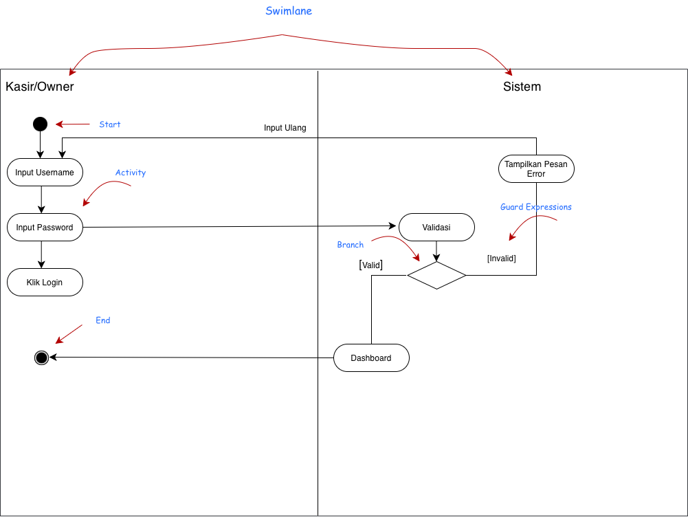
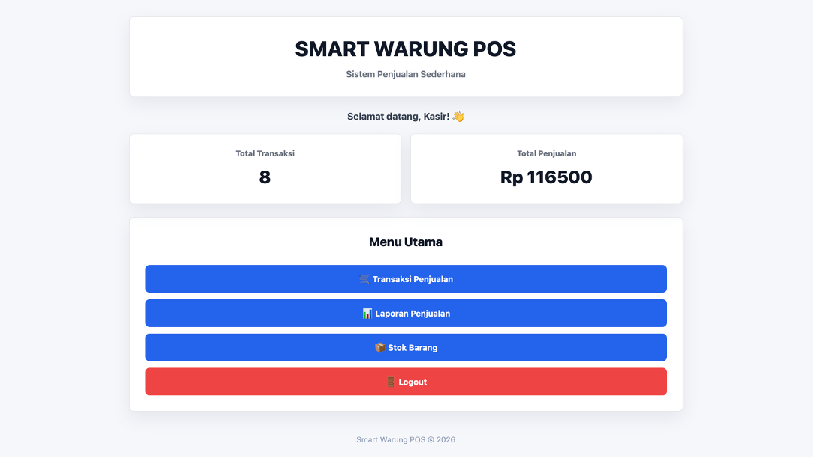
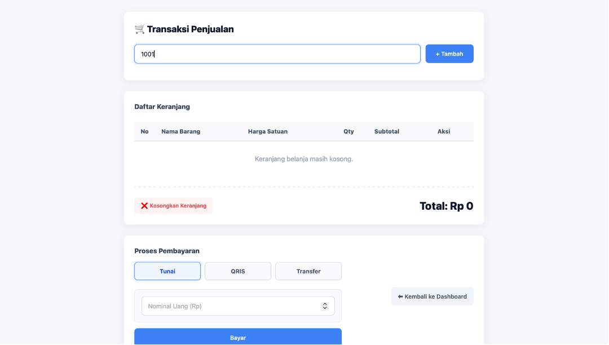
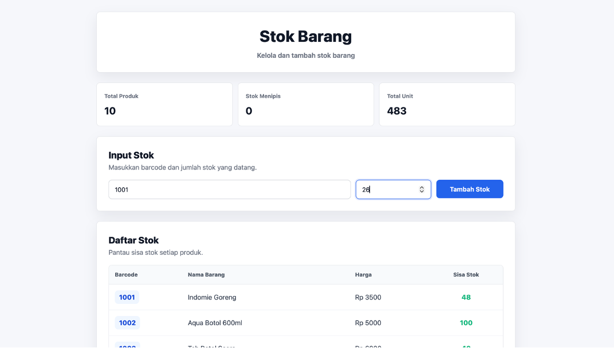
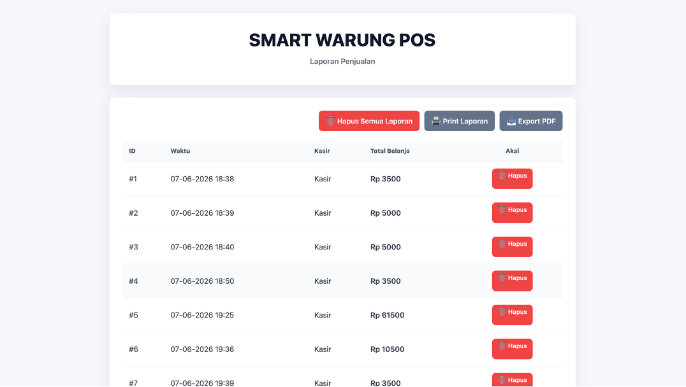

# 🚀 Smart Warung POS Presentation App

[](https://html.spec.whatwg.org/)
[](https://www.w3.org/Style/CSS/)
[](https://developer.mozilla.org/en-US/docs/Web/JavaScript)
[](https://sqlite.org/)
[](https://flask.palletsprojects.com/)

A premium, interactive, and aesthetically stunning web-based slideshow presentation showcasing the design, UML modeling, and implementation of the **Smart Warung POS (Point of Sale)** system developed for **Kedai Dafo**. 

This repository houses the interactive presentation web app, detailing all UML diagrams (Use Case, Class, Activity, Sequence, Collaboration, Statechart) and source code representations.

---

## 🎨 Presentation Features

- **Premium UI/UX Design**: Engineered with a modern glassmorphism aesthetic, sleek dark mode transitions, and customized gradients.
- **Interactive Navigation Sidebar**: Effortlessly jump between presentation sections (UML design, codebase, implementations, and summaries).
- **Keyboard Shortcuts**: Navigate slides with ease (`ArrowRight` / `Space` for Next, `ArrowLeft` for Prev, and `T` to toggle sidebar visibility).
- **Interactive Source Code Viewer**: Integrated code display window for `app.py` and `init_db.py` with syntax highlighting.
- **Click-to-Zoom Lightbox Modal**: View complex UML diagrams in full detail with scroll-to-zoom and click-and-drag panning.
- **Walkthrough Simulator**: Step-by-step interactive simulator displaying user flows (Authentication, Checkout, Stock Management, Reporting) alongside real screenshots.

---

## 🏗️ POS Application System Architecture

The modeled application itself is built upon a lightweight and reliable web architecture:

- **Backend**: Python / Flask (MVC-like pattern managing transactions, products, and users).
- **Database**: SQLite (Relational DB utilizing relational mappings for detail transactions).
- **Access Control**: Role-Based Access Control (RBAC) separating **Kasir** (only transactions/checkout) and **Owner** (financial dashboard, product stock management, reporting).

---

## 📂 Repository Directory Structure

```text
POS/
├── assets/
│   ├── css/
│   │   └── style.css                     # Premium styling sheets
│   ├── use-case/
│   │   └── use case.png                  # Use Case UML Diagram
│   ├── class-diagram/
│   │   └── class diagram.png             # Class UML Diagram
│   ├── activity-diagram/                 # Activity UML Diagrams (Login, Penjualan, Laporan)
│   ├── sequence-diagram/                 # Sequence UML Diagrams (Login, Pembayaran, Laporan)
│   ├── collaboratiion-diagram/           # Collaboration UML Diagrams (Login, Penjualan, Laporan)
│   ├── statechart-diagram/               # Statechart UML Diagrams (Login, Penjualan, Laporan)
│   └── application-screenshots/          # POS App Screenshots & Source Code captures
├── index.html                            # Core Presentation HTML structure
├── script.js                             # Interactive slide & simulator controller
└── README.md                             # Documentation
```

---

## ⚙️ Installation & Usage

As the presentation is a standalone, client-side web application, no compilation or complex server setup is required.

### Local Execution
1. Clone the repository:
   ```bash
   git clone https://github.com/jonnyficky2/Smart-warung-POS-persentation.git
   ```
2. Navigate to the project folder:
   ```bash
   cd Smart-warung-POS-persentation
   ```
3. Open `index.html` in your web browser, or launch it using a local development server (e.g. Live Server in VS Code, or python simple HTTP server):
   ```bash
   python3 -m http.server 8000
   ```

---

## 📸 Screenshots & Diagrams Preview

<details>
<summary><b>📐 UML Diagrams (Click to Expand)</b></summary>
<br>

| Diagram | Preview |
| --- | --- |
| **Use Case Diagram** |  |
| **Class Diagram** |  |
| **Activity Login** |  |
| **Sequence Pembayaran** |  |

</details>

<details>
<summary><b>🖥️ POS Application Interface (Click to Expand)</b></summary>
<br>

| Halaman | Preview |
| --- | --- |
| **Login Screen** |  |
| **Dashboard Owner** |  |
| **Transaksi POS** |  |
| **Kelola Stok** |  |
| **Laporan Owner** |  |

</details>

---

## 🧑‍💻 Author

- **Jonny Ficky** - [jonnyficky2](https://github.com/jonnyficky2)
